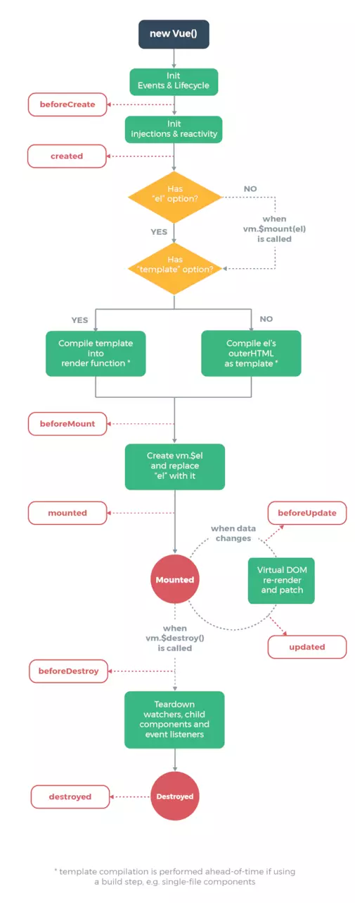

# 丰富的选项合并策略

## 1.1 Vue 的引入

Vue 的使用按照官方的说法支持 CDN 和 NPM 两种方式，CDN 的方式是以 script 的方式将打包好的 vue.js 引入页面脚本中，而 NPM 的方式是和诸如 webpack 或 Browserify 模块打包器配置使用，以 npm install vue 的方式引入，这也是我们开发应用的主要形式。而从单纯分析源码思路和实现细节的角度来讲，打包后的 vue.js 在分析和提炼源码方面会更加方便，所以这个系列的源码分析，使用的是打包后的 vue 脚本，版本号是 v2.6.8

### 1.1.1 基础使用

```javascript
<div id="app"></div>
<script src="https://cdn.jsdelivr.net/npm/vue@2.6.8/dist/vue.js"></script>
<script>
var vm = new Vue({
  el: '#app',
  data: {
    message: '选项合并'
  },
})
</script>

```

### 1.1.2 Vue 构造器

> 打包后的源码是遵从 UMD 规范的，它是 commonjs 和 amd 的整合。而 Vue 的本质是一个构造器,并且它保证了只能通过 new 实例的形式去调用，而不能直接通过函数的形式使用。

```javascript
(function (global, factory) {
  // 遵循UMD规范
  // UMD 包括 commonJS和AMD两种模块规范化
  typeof exports === 'object' && typeof module !== 'undefined' ? module.exports = factory() :
  typeof define === 'function' && define.amd ? define(factory) :
  (global = global || self, global.Vue = factory());
}(this, function () { 'use strict';
  ···
  // Vue 构造函数
  function Vue (options) {
    // 保证了无法直接通过Vue()去调用，只能通过new的方式去创建实例
    if (!(this instanceof Vue)
    ) {
      warn('Vue is a constructor and should be called with the `new` keyword');
    }
    this._init(options);
  }
  return Vue
})


```

### 1.1.3 定义原型属性方法

首先是原型上的属性方法，在构造函数的定义之后，有这样五个函数，他们分别针对不同场景定义了 Vue 原型上的属性和方法。

```javascript
// 定义Vue原型上的init方法(内部方法)
initMixin(Vue)
// 定义原型上跟数据相关的属性方法
stateMixin(Vue)
//定义原型上跟事件相关的属性方法
eventsMixin(Vue)
// 定义原型上跟生命周期相关的方法
lifecycleMixin(Vue)
// 定义渲染相关的函数
renderMixin(Vue)
```

### 1.1.4 定义静态属性方法

```javascript
/* 初始化构造器的api */
function initGlobalAPI (Vue) {
    // config
    var configDef = {};
    configDef.get = function () { return config; };
    {
      configDef.set = function () {
        warn(
          'Do not replace the Vue.config object, set individual fields instead.'
        );
      };
    }
    // 通过Vue.config拿到配置信息
    Object.defineProperty(Vue, 'config', configDef);

    // 工具类不作为公共暴露的API使用
    Vue.util = {
      warn: warn,
      extend: extend,
      mergeOptions: mergeOptions,
      defineReactive: defineReactive###1
    };

    // Vue.set = Vue.prototype.$set
    Vue.set = set;
    // Vue.delete = Vue.prototype.$delete
    Vue.delete = del;
    // Vue.nextTick = Vue.prototype.$nextTick
    Vue.nextTick = nextTick;

    // 2.6 explicit observable API
    Vue.observable = function (obj) {
      observe(obj);
      return obj
    };

    // 构造函数的默认选项默认为components,directive,filter, _base
    Vue.options = Object.create(null);
    ASSET_TYPES.forEach(function (type) {
      Vue.options[type + 's'] = Object.create(null);
    });

    // options里的_base属性存储Vue构造器
    Vue.options._base = Vue;
    extend(Vue.options.components, builtInComponents);
    // Vue.use()
    initUse(Vue);
    // Vue.mixin()
    initMixin$1(Vue);
    // 定义extend扩展子类构造器的方法
    // Vue.extend()
    initExtend(Vue);
    // Vue.components, Vue.directive, Vue.filter
    initAssetRegisters(Vue);
  }

```

## 1.2 构造器的默认选项

Vue 内部本身会自带一些默认的选项，这些选项和用户自定义的选项会在后续一起参与到 Vue 实例的初始化中。

在 initGlobalAPI 方法中有几行默认选项的定义。Vue 内部的默认选项会保留在静态的 options 属性上，从源码看 Vue 自身有四个默认配置选项，分别是 component，directive， filter 以及返回自身构造器的\_base。

```javascript
var ASSET_TYPES = ['component', 'directive', 'filter']

Vue.options = Object.create(null)
ASSET_TYPE.forEach(function (type) {
	Vue.option[type + 's'] = Object.create(null)
})
Vue.options._base = Vue
```

很明显我们开发者对这几个选项是非常熟悉的，components 是需要注册的组件选项，directives 是需要注册的指令，而 filter 则代表需要注册的过滤器。从代码的实现细节看，Vue 为 components 提供了 keepAlive,transition,transitionGroup 的内置组件，为 directives 提供了 v-model,v-show 的内置指令，而过滤器则没有默认值。

```javascript
// Vue 内置组件
var builtInComponents = {
	KeepAlive: KeepAlive,
}

var platformComponents = {
	Transition: Transition,
	TransitionGroup: TransitionGroup,
}

// Vue内置指令
var platformDirective = {
	model: directive,
	show: show,
}

extend(Vue.options.components, builtInComponents)
extend(Vue.options.components, platformComponents) // 扩展内置组件
extend(Vue.options.directives, platformDirectives) // 扩展内置指令
```

其中 extend 方法实现类对象的合并，如果属性相同，则用新值覆盖旧值

```javascript
// 将_from对象合并到to对象，属性相同时，则覆盖to对象的属性
function extend(to, _form) {
	for (var key in _form) {
		to[key] = _form[key]
	}
	return to
}
```

因此做为构造器而言，Vue 默认的资源选项配置如下：

```javascript
Vue.options = {
  components:{
    KeepAlive:{}
    Transition:{}
    TransitionGroup:{}
  },
  directives:{
    model:{inserted:f,componentUpdated:f}
    show:{bind:f,update:f,unbind:f}
  },
  filters:{},
  _base
}

```

## 1.3 选项检验

介绍完 Vue 自身拥有的选项后，我们回过头来看看，实例化 Vue 的阶段发生了什么。从构造器的定义我们很容易发现，实例化 Vue 做的核心操作便是执行\_init 方法进行初始化。初始化操作会经过选项合并配置，初始化生命周期，初始化事件中心，乃至构建数据响应式系统等。而关键的**第一步就是对选项的合并**。合并后的选项会挂载到实例的$options属性中。(你可以先在实例中通过this.$options 访问最终的选项)

```javascript
funciton initMixin(Vue){
    Vue.prototype._init = funciton(options){
        var vm = this;
        // a uid 
        //记录实例化多少个vue对象
        vm._uid = uid$3++;
        //选项合并，将合并后的选项值赋值给$options属性
        vm.$options=mergeOptions(
        	resolveConstructorOptions(vm.constructor),//返回Vue构造函数自身的配置项
            option||{},
            vm	
        )
    }
}
```
mergeOptions实现
```javascript
funtion mergeOptions(parent,child,vm){
    {
        checkComponents(child);
    }
    if(typeof child === 'function'){
        child = child.options
    }
    //props,inject,directive的校验和规范化
    normalizeProps(child,vm);
    normalizeInject(child,vm);
    normalizeDirective(child,vm);
    
    //针对extends扩展的子类构造器
    if(!child._base){
    	//extends
    	if(child.extends){
    		parent = mergeOptions(parent,child.extends,vm)
    	}
    	//mixins
    	if(child.mixins){
            for(var i = 0,l = child.mixins.length;i<l;i++){
				parent = mergeOptions(parent,child.mixins[i],vm)
            }
    	}
    }
    
    var options = {};
    var key;
    for(key in parent){
    	mergeField(key);
    }
    for(key in child){
    	if(!hasOwn(parent,key)){
    		mergeField(key);
    	}
    }
    funciton mergeField(key){
    	//拿到各个选择指定的选项配置，如果没有使用默认配置
    	var start = start[key]||defaultStart;
    	//执行各自的合并策略
    	option[key]=start(parent[key],child[key],vm)
    }
    //console.log(options)
    return options
}
```
**选项合并过程中更多的不可控在于不知道用户传递了哪些配置选项，这些配置是否符合规范，是否达到合并配置的要求。因此每个选项的书写规则需要严格限定，原则上不允许用户脱离规则外来传递选项。**因此在合并选项之前，很大的一部分工作是对选项的校验。其中components,prop,inject,directive等都是检验的重点。

### 1.3.1 components规范检验
如果项目中需要使用到组件，我们会在vue实例化时传入组件选项以此来注册组件。因此，组件命名需要遵守很多规范，比如组件名不能用html保留的标签(如：img,p),也不能包含非法的字符等。这些都会在validateComponentName函数做校验。
```javascript
//components规范检查函数
function checkComponents(options){
	//遍历components对象，对每个属性值校验.
	for(var key in options.components){
		validateComponentName(key)
	}
}
function validateComponentName(name){
	if(!new RegExp(("^[a-zA-Z][\\-\\.0-9_"+(unicodeRegExp.source)+"]*$")).test(name)){
		warn('Invalid component name: "' + name + '". Component names ' +
      'should conform to valid custom element name in html5 specification.')
	}
// 不能使用Vue自身自定义的组件名，如slot, component,不能使用html的保留标签，如 h1, svg等
	if (isBuiltInTag(name) || config.isReservedTag(name)) {
        warn(
        'Do not use built-in or reserved HTML elements as component ' +
        'id: ' + name
        );
  }
}
```
### 1.3.2 props规范检验

Vue的官方文档规定了props选项的书写形式有两种，分别是

1. 数组形式 { props: ['a', 'b', 'c'] },
2. 带校验规则的对象形式 { props: { a: { type: 'String', default: 'prop校验' } }} 从源码上看，**两种形式最终都会转换成对象的形式。**

```javascript
// props规范校验
  function normalizeProps (options, vm) {
    var props = options.props;
    if (!props) { return }
    var res = {};
    var i, val, name;
    // props选项数据有两种形式，一种是['a', 'b', 'c'],一种是{ a: { type: 'String', default: 'hahah' }}
    // 数组
    if (Array.isArray(props)) {
      i = props.length;
      while (i--) {
        val = props[i];
        if (typeof val === 'string') {
          name = camelize(val);
          // 默认将数组形式的props转换为对象形式。
          res[name] = { type: null }; 
        } else {
          // 规则：保证是字符串
          warn('props must be strings when using array syntax.');
        }
      }
    } else if (isPlainObject(props)) {
      for (var key in props) {
        val = props[key];
        name = camelize(key);
        res[name] = isPlainObject(val)
          ? val
          : { type: val };
      }
    } else {
      // 非数组，非对象则判定props选项传递非法
      warn(
        "Invalid value for option \"props\": expected an Array or an Object, " +
        "but got " + (toRawType(props)) + ".",
        vm
      );
    }
    options.props = res;
  }

```
### 1.3.3 inject的规范校验
`provide/inject`这对组合在我们日常开发中可能使用得比较少，当我们需要在父组件中提供数据或者方法给后代组件使用时可以用到`provide/inject`,注意关键是后代，而不单纯指子代，这是有别于`props`的使用场景。官方把它被称为依赖注入，依赖注入使得组件后代都能访问到父代注入的数据/方法，且后代不需要知道数据的来源。重要的一点，依赖提供的数据是非响应式的。

```javascript
//父组件
var Provider ={
    provide:{
        foo:'bar'
    },
    //...
}
//后代组件
var Child={
    //数组写法
    inject:['foo']
    //对象写法
    inject:{
    	form:'foo',
        default:'bardefault'
    }
}
```

`inject`选项有两种写法，数组的方式以及对象的方式，和`props`的校验规则一致，最终`inject`都会转换为对象的形式存在。

```javascript
// inject的规范化
function normalizeInject (options, vm) {
    var inject = options.inject;
    if (!inject) { return }
    var normalized = options.inject = {};
    //数组的形式
    if (Array.isArray(inject)) {
      for (var i = 0; i < inject.length; i++) {
        // from: 属性是在可用的注入内容中搜索用的 key (字符串或 Symbol)
        normalized[inject[i]] = { from: inject[i] };
      }
    } else if (isPlainObject(inject)) {
      // 对象的处理
      for (var key in inject) {
        var val = inject[key];
        normalized[key] = isPlainObject(val)
          ? extend({ from: key }, val)
          : { from: val };
      }
    } else {
      // 非法规则
      warn(
        "Invalid value for option \"inject\": expected an Array or an Object, " +
        "but got " + (toRawType(inject)) + ".",
        vm
      );
    }
  }

```

### 1.3.4 directive的规范校验

我们先看看指令选项的用法，`Vue`允许我们自定义指令，并且它提供了五个钩子函数`bind, inserted, update, componentUpdated, unbind`,具体的用法可以参考[官方-自定义指令](https://cn.vuejs.org/v2/guide/custom-directive.html)文档,而除了可以以对象的形式去定义钩子函数外，官方还提供了一种函数的简写，例如：

```javascript
{
  directives: {
    'color-swatch': function(el, binding) {
        el.style.backgroundColor = binding.value
    }
  }
}

```

函数的写法会在`bind,update`钩子中触发相同的行为，并且不关心其他钩子。这个行为就是定义的函数。因此在对`directives`进行规范化时，针对函数的写法会将行为赋予`bind,update`钩子。

```javascript
function normalizeDirectives (options) {
    var dirs = options.directives;
    if (dirs) {
      for (var key in dirs) {
        var def###1 = dirs[key];
        // 函数简写同样会转换成对象的形式
        if (typeof def###1 === 'function') {
          dirs[key] = { bind: def###1, update: def###1 };
        }
      }
    }
  }
```

### 1.3.5 函数缓存

这个内容跟选项的规范化无关，当读到上面规范检测的代码时，笔者发现有一段函数优化的代码值得我们学习。它将每次执行函数后的值进行缓存，当再次执行的时候直接调用缓存的数据而不是重复执行函数，以此提高前端性能，这是典型的用空间换时间的优化，也是经典的偏函数应用。

```javascript
function cached(fn){
    var cache = Object.create(null);//创建空对象作为缓存对象
    return(function cacheFn(str){
        var hit = cache[str]
        return hit||(cache[str]=fn(str))//每次执行时缓存对象有值则不需要执行函数方法，没有则执行并缓存起来。
    })
    var camelizeRE = /-(\w)/g;
    
    //缓存会保存每次进行驼峰转换的结果
    var camelize = cached(function(str){
    	// 将诸如 'a-b'的写法统一处理成驼峰写法'aB'
         return str.replace(camelizeRE, function (_, c) { return c ? c.toUpperCase() : ''; })

    })
}
```


## 1.4 子类构造器

选项校验介绍完后，在正式进入合并策略之前，还需要先了解一个东西：子类构造器。为什么需要先提到子类构造器呢？

按照前面的知识，`Vue`内部提供了四个默认选项，关键的三个是`components,directives,filter`。那么当我们传递一个选项配置到`Vue`进行初始化，所需要合并的选项好像也仅仅是那关键的三个默认选项而已，那么源码中大篇幅做的选项合并策略又是针对什么场景呢？答案就是这个子类构造器。

**`Vue`提供了一个`Vue.extend`的静态方法，它是基于基础的`Vue`构造器创建一个“子类”，而这个子类所传递的选项配置会和父类的选项配置进行合并。这是选项合并场景的由来。**

因此有不要先了解子类构造器的实现。下面例子中，我们创建了一个`Child`的子类，它继承于父类`Parent`,最终将子类挂载到`#app`元素上。最终获取的`data`便是选项合并后的结果。

```javascript
var Parent = Vue.extend({
    data(){
        test:'父类',
        test1:'父类1',
    }
})

var Child = Parent.extend({
    data(){
    	test:'子类',
        test2:'子类2'
	}
})
var vm = new Child().$mount('#app');
console.log(vm.$data)

//结果
{
    test:'子类',
    test1:'父类1',
    test2:'子类2'
}
```

`Vue.extend`的实现思路很清晰，创建了一个`Sub`的类，这个类的原型指向了父类，并且子类的`options`会和父类的`options`进行合并，`mergeOptions`的其他细节接下来会重点分析。

```javascript
Vue.extend = function(extendOptions){
    extendOptions = extendOptions || {};
    var Super = this;
    var name = extendOptions.name || Super.options.name;
    if(name){
        validateComponentName(name);// 校验子类的名称是否符合规范
    }
    
    //创建子类构造器
    var Sub = function VueComponent(options){
        this._init(options)
    }
    Sub.prototype = Object.create(Super.prototype)//子类继承父类
    Sub.prototype.constructor = Sub;
    Sub.cid = cid++;
    //子类和父类构造器的配置选项进行合并
    Sub.options = mergeOptions(
        Super.options,
        extendOptions
    );
    return Sub
}
```

## 1.5 合并策略

合并策略之所以是难点，其中一个是合并选项类型繁多，合并规则随着选项的不同也呈现差异。概括起来思路主要是以下两点：

1. `Vue`针对每个规定的选项都有定义好的合并策略，例如`data,component,mounted`等。如果合并的子父配置都具有相同的选项，则只需要按照规定好的策略进行选项合并即可。
2. 由于`Vue`传递的选项是开放式的，所有也存在传递的选项没有自定义选项的情况，这时候由于选项不存在默认的合并策略，所以处理的原则是有子类配置选项则默认使用子类配置选项，没有则选择父类配置选项。

我们通过这两个思想去分析源码的实现，先看看`mergeOptions`除了规范检测后的逻辑。

```javascript
function ,mergeptions(parent,child,vm){
    ...
    var options = {};
    var key;
    for(key in parent){
        mergeField(key)
    }
    for(key in child){
        if(!hasOwn(parent,key)){
            mergeField(key);
        }
    }
    funtion mergeField(key){
        //如果有自定义选项策略，则使用自定义选项策略，否则使用默认选项策略
        var start = strats[key]||defaultStrat;
        options[key] = start(parent[key],child[key],vm,key)
    }
    return options
}
```

**两个`for`循环规定了合并的顺序，以自定义选项策略优先，如果没有才会使用默认策略。而`strats`下每个`key`对应的便是每个特殊选项的合并策略**

### 1.5.1 默认策略

我们可以用丰富的选项去定义实例的行为，大致可以分为以下几类：

1. 用`data,props,computed`等选项定义实例数据
2. 用`mounted, created, destoryed`等定义生命周期函数
3. 用`components`注册组件
4. 用`methods`选项定义实例方法

当然还有诸如`watch,inject,directives,filter`等选项，总而言之，`Vue`提供的配置项是丰富的。除此之外，我们也可以使用没有默认配置策略的选项，典型的例子是状态管理`Vuex`和配套路由`vue-router`的引入：

```javascript
new Vue({
    state,//vuex
    router//vue-router
})
```

不管是插件也好，还是用户自定义的选项，他们的合并策略会遵循思路的第二点：**子配置存在则取子配置，不存在则取父配置，即用子去覆盖父。。**它的描述在`defaultStrat`中。

```javascript
// 用户自定义选项策略
var defaultStrat = function (parentVal, childVal) {
  // 子不存在则用父，子存在则用子配置
  return childVal === undefined
    ? parentVal
    : childVal
};

```

接下来会进入某些具体的合并策略的分析，大致分为五类：

**1. 常规选项合并**

**2. 自带资源选项合并**

**3. 生命周期钩子合并**

**4. `watch`选项合并**

**5. `props,methods, inject, computed`类似选项合并**	

## 1.6 常规选项的合并

### 1.6.1 el的合并

`el`提供一个在页面上已存在的 `DOM` 元素作为 `Vue` 实例的挂载目标,因此它只在创建`Vue`实例才存在，在子类或者子组件中无法定义`el`选项，因此`el`的合并策略是在保证选项只存在于根的`Vue`实例的情形下使用默认策略进行合并。

```javascript
starts.el = function(parent,child,vm,key){
    if(!vm){//只允许vue实例拥有el属性，其它子类构造器不允许有el属性
        warn('...')
    }
    return defaultStart(parent,child)
}
```

### 1.6.2 data合并

常规选项的重点部分是在于`data`的合并，读完这部分源码，可能可以解开你心中的一个疑惑，为什么`data`在`vue`创建实例时传递的是一个对象，而在组件内部定义时只能传递一个函数。

```javascript
//data的合并
start.data = function(parentVal,childVal,vm){
    //vm代表是否为Vue创建的实例，否则是子父类的关系
    if(!vm){
        if(childVal && typeof childVal != 'function'){
            warn('...')
            return parentVal
        }
       return mergeDataOrFn(parentVal,childVal)
    }
    return mergeDataOrFn(parentVal,childVal,vm)
}
```

`data`策略最终调用的`mergeDataOrFn`方法，区别在于当前`vm`是否是实例，或者是单纯的子父类的关系。如果是子父类的关系，需要对`data`选项进行规范校验，保证它的类型是一个函数而不是对象。

```javascript
function mergeDataOrFn(parentVal,childVal,vm){
	//子父类
    if(!vm){
      if(!childVal){
          return parentVal
      }
      if(!parentVal){
          return childVal
      }
      return function mergeDataFn(){
          //data选项在父类和子类同时存在的情况下返回的是一个函数
          //子类实例和父类实例，分别将子类和父类实例中的data函数执行后返回的对象传给mergeData函数做数据合并
          return mergeData(
              typeof childVal === 'function' ? childVal.call(this,this):childVal,
              typeof parentVal === 'funciton' ? parentVal.call(this,this):parentVal
          )
      }
    }else{
 	//Vue实例
    	//Vye构造函数实例对象
        return function mergeInstanceDataFn(){
            var instanceData = typeof childVal === 'function' ? childVal.call(vm,vm)
            var defaultData = typeof parentVal === 'function' ? parent.call(vm,vm)
            if(instanceData){
                //当实例中传递data选项时,将实例的data对象和Vm构造函数上的data属性合并
                return mergeData(instanceData,defaultData)
            }else{
                return defaultData
            }
        }
    }
}
```

从源码的实现看，`data`的合并不是简单的将两个数据对象进行合并，而是直接返回一个`mergedDataFn`或者`mergedInstanceDataFn`函数，而真正合并的时机是在后续初始化数据响应式系统的环节进行的，初始化数据响应式系统的第一步就是拿到合并后的数据，也就是执行`mergeData`逻辑。 (关于响应式系统的构建请移步后面的章节)

```js
function mergeData (to, from) {
  if (!from) { return to }
  var key, toVal, fromVal;
  // Reflect.ownKeys可以拿到Symbol属性
  var keys = hasSymbol
    ? Reflect.ownKeys(from)
    : Object.keys(from);

  for (var i = 0; i < keys.length; i++) {
    key = keys[i];
    toVal = to[key];
    fromVal = from[key];
    if (!hasOwn(to, key)) {
      // 子的数据父没有，则将新增的数据加入响应式系统中。
      set(to, key, fromVal); 
    } else if (
      toVal !== fromVal &&
      isPlainObject(toVal) &&
      isPlainObject(fromVal)
    ) {
      // 处理深层对象，当合并的数据为多层嵌套对象时，需要递归调用mergeData进行比较合并
      mergeData(toVal, fromVal);
    }
  }
  return to
}

```

`mergeData`方法的两个参数是父`data`选项和子`data`选项的结果，也就是两个`data`对象，从源码上看数据合并的原则是，将父类的数据整合到子类的数据选项中， 如若父类数据和子类数据冲突时，保留子类数据。如果对象有深层嵌套，则需要递归调用`mergeData`进行数据合并。

最后回过头来思考一个问题，为什么`Vue`组件的`data`是一个函数，而不是一个对象呢？ 我觉得可以这样解释：**组件设计的目的是为了复用，每次通过函数创建相当于在一个独立的内存空间中生成一个`data`的副本，这样每个组件之间的数据不会互相影响。**


//扩展

`Reflect.ownKeys`返回一个由目标对象自身的属性键组成的数组。

```js
const object1 = {
  property1: 42,
  property2: 13
};

const array1 = [];

console.log(Reflect.ownKeys(object1));
// expected output: Array ["property1", "property2"]

console.log(Reflect.ownKeys(array1));
// expected output: Array ["length"]
```

`Object.keys`方法会返回一个由一个给定对象的自身可枚举属性组成的数组，数组中属性名的排列顺序和正常循环遍历该对象时返回的顺序一致 。

```js
// simple array
var arr = ['a', 'b', 'c'];
console.log(Object.keys(arr)); // console: ['0', '1', '2']

// array like object
var obj = { 0: 'a', 1: 'b', 2: 'c' };
console.log(Object.keys(obj)); // console: ['0', '1', '2']

// array like object with random key ordering
var anObj = { 100: 'a', 2: 'b', 7: 'c' };
console.log(Object.keys(anObj)); // console: ['2', '7', '100']

// getFoo is a property which isn't enumerable
var myObj = Object.create({}, {
  getFoo: {
    value: function () { return this.foo; }
  }
});
myObj.foo = 1;
console.log(Object.keys(myObj)); // console: ['foo']
```


## 1.7 自带资源选项的合并

在1.2中我们看到了`Vue`默认会带几个选项，分别是`components`组件, `directive`指令, `filter`过滤器,所有无论是根实例，还是父子实例，都需要和系统自带的资源选项进行合并。它的定义如下：

```js
// 资源选项
var ASSET_TYPES = [
  'component',
  'directive',
  'filter'
];

// 定义资源合并的策略
ASSET_TYPES.forEach(function (type) {
  strats[type + 's'] = mergeAssets; // 定义默认策略
});

```

这些资源选项的合并逻辑很简单，首先会创建一个原型指向父类资源选项的空对象，再将子类选项赋值给空对象。

```js
// 资源选项自定义合并策略
function mergeAssets (parentVal,childVal,vm,key) {
  var res = Object.create(parentVal || null); // 创建一个空对象，其原型指向父类的资源选项。
  if (childVal) {
    assertObjectType(key, childVal, vm); // components,filters,directives选项必须为对象
    return extend(res, childVal) // 子类选项赋值给空对象
  } else {
    return res
  }
}
```

结合下面的例子，我们看具体合并后的结果：

```js
var vm = new Vue({
    components:{
        coponentsA:{}
    },
    directives:{
        'v-boom':{}
    }
})

console.log(vm.$options.components)
//根实例的选项和资源默认选项合并后的结果
{
    components:{
        componentA:{},
        __proto__:{
            KeepAlive:{},
            Transition:{},
            TransitionGroup:{}
        }
    },
    driectives:{
        'v-boom':{},
        __proto__:{
            'v-show':{},
            'v-model':{}
        }
    }
}
```

简单总结一下，对于 `directives、filters` 以及 `components` 等资源选项，**父类选项将以原型链的形式被处理**。子类必须通过原型链才能查找并使用内置组件和内置指令。

## 1.8 生命周期钩子函数的合并

在学习`Vue`时，有一个重要的思想，生命周期。它是我们使用`Vue`高效开发组件的基础，我们可以在组件实例的不同阶段去定义需要执行的函数，让组件的功能更加丰富。在介绍生命周期钩子函数的选项合并前，我们有必要复习以下官方的生命周期图。



然而从源码中我们可以看到`Vue`的生命周期钩子不止这些，它有多达12个之多，每个钩子的执行时机我们暂且不深究，它们会在以后的章节中逐一出现。我们关心的是：子父组件的生命周期钩子函数是遵循什么样的规则合并。

## 1.9 watch 选项合并

## 1.10 props methods inject component 合并

## 1.11 小结
